### Table of contents:

[Purpose](#purpose)

[User Stories](#user-stories) 

[Design and UX](#design-and-ux) 
* [Story map and flow chart](#story-map-and-flow-chart)

[Features](#features)

[Technologies](#technologies)

[Testing ](#testing)
* [Code Validation](#code-validation)
* [Browser Compatibility](#browser-compatibility)
* [Performance Testing](#performance-testing)
* [Manual Testing](#manual-testing)
* [User Stories Testing](#user-stories-testing)

[Debugging and known bugs](#debugging-and-known-bugs)

[Deployment](#deployment)

[Credits](#credits)

[Acknowledgements](#acknowledgements)

### Purpose

The Rhubarb Witch is a text-based choose your own adventure game with Dungeons and Dragons mechanics. At the beginning of the game, you choose a character class: Barbarian, Rogue or Sorcerer. At each fork in the path the program will roll a ‘dice’ which will determine whether you succeed or fail in taking that action. The class you chose affects the outcome of the dice roll, which will be further explained in the Design section of the Readme.

Live link:
[The Rhubarb Witch](https://the-rhubarb-witch.herokuapp.com/)

### User Stories

A first time user looking to play the game:
* I want to be able to choose a character
* I want the instructions to be clear
* I want the game to be engaging

A returning user looking to play the game again:
* I want to be able to play the game multiple times without the same ending/path
* I want to be able to choose a different character

As the owner of the site:
* I want users to be able to use the game easily and intuitively
* I want the game to be engaging
* I want errors to be handled efficiently
* I want what is going on to be clear to the users at all times

### Design and UX

Inspiration for this game is taken from shows such as [Dimenson 20](https://www.youtube.com/watch?v=_zZxCVBi7-k) and [Polygon’s TTRPG videos](https://www.youtube.com/watch?v=oCp_2hqguUg&t=27s).

In D&D, almost every action is accompanied by a roll of a dice, usually one with twenty sides known as a D20. There are many variables as to the success or failure of your action, not just the roll but the stats of your character, special moves and so on. This is too intricate and complicated for this short, simple game so I have pre-determined the player’s stats for each action/path based on the character classes. That information can be found below and is in the form of a simple + or - for each divergent path. The stats are based on the characteristics of each class; for example, a barbarian would be likely to make a bold move so that would be a positive number, but a subtle or stealthy move would be negative for a barbarian, but positive for a rogue.
The pre-determined statistics can be found here:

[Stats document](assets/readme-files/documents/stats.doc) (Github will open a page and you will see a link that says 'View raw'; this will open the Word document, Open Office can also be used)

At each path the program will roll a number between 1 and 20 and the stat will be added or taken away from the number. If it is 1-10 inclusive the move fails and the player will be sent down the opposite path, 11-20 inclusive then the move succeeds. This will hopefully make the game more dynamic than a standard choose your own adventure and allow the player to have multiple playthroughs without the same path each time.

It is possible, after the character stats have been taken into account, for the final roll to be below 1 or above 20. This is the same case in D&D so I have left it in. It makes the success sweeter or makes the failure feel harsher.

Text is kept relatively short to keep the user engaged. The game never goes more than a few sentences (usually 2 or 3) before introducing a choice.

The colors are all set to 'bright' as the standard Python colours are a little dim in the HTML terminal. I have used Colorama for my text rather than ANSI as it is more graceful and makes the code easier to parse. Colour communicates a lot to the user so it is a very important element of the project, as further explained in the Features section.

### Story map and flow chart

Due to spending a week with limited internet, I ended up planning this project before starting the Love Sandwiches walkthrough and learning what a flow chart is. When writing out the story and the paths of the story I ended up with an accidental flow chart but it is in the format of a word document, which can be found below, along with photos of the handwritten version.

[Story map/flow chart document](assets/readme-files/documents/game-text.doc) (Github will open a page and you will see a link that says 'View raw'; this will open the Word document, Open Office can also be used)

Original document
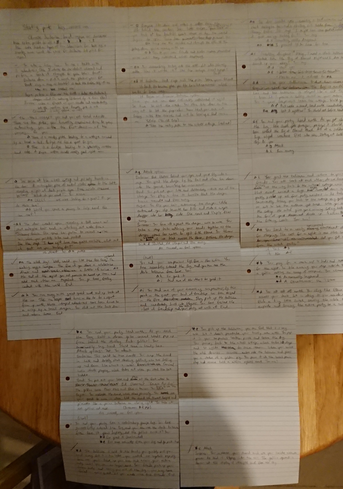

### Features

Introduction - welcome text in magenta to mirror the colour of rhubarb.

User name - user is given a themed name at the beginning of the game. Names and code are adapted from my previous Javascript project [Wizard Name Generator](https://elyserh.github.io/wizard-name-generator/index.html). This is the first time the user is asked for input so I have included instructions to 'hit enter' as it is not immediately obvious to every player. It also sets the player up to do the same for each following input without further instruction. Includes error handler if no name is entered.

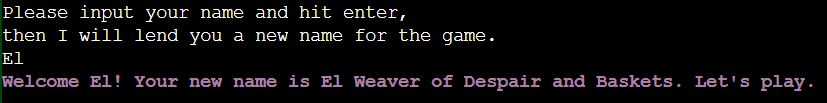

Instructions - game explained clearly and efficiently, with a header to distinguish it from the rest of the text on the screen.

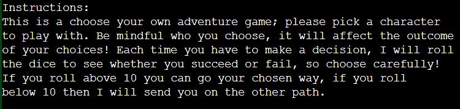

Character choice - user is given a choice of 3 characters. Enough to make it interesting but not so many as to be overwhelming. Character choice is confirmed by printing the same choice back to the user. Includes error handler.

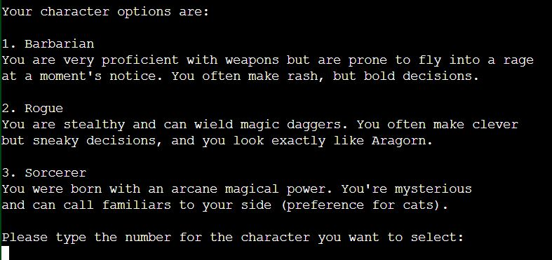

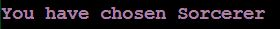

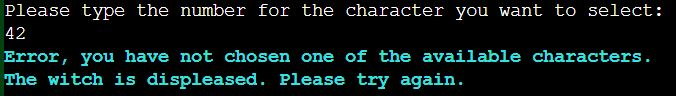

Text width - the text does not extend the width of the page; during initial testing, I discovered that it was easier to parse and pay attention to the text if it took up less width of the page. If it takes up the full width the whole field is filled and the user is overloaded before having read anything. In a text-heavy game, I am keen to avoid this if I can.

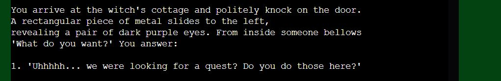

Path choice - user is given a choice of path, which includes error handler.

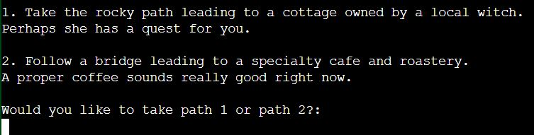

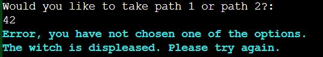

Rolling - line break between the player making a choice and the computer revealing the decision to build suspense and highlight that a ‘roll’ is being made. The text is coloured yellow to show that a roll is in progress, not yet red (fail) and not yet green (success).

Final roll - final roll is shown to the player to indicate whether they have succeeded or failed. The success or fail message and the final roll number will be shown in red (fail) or green (success) to heighten the user's connection to the roll. These colours will hopefully elicit an emotional response that engages the player in the game. There are 2 text variants for each, each stating whether you succeed or fail and whether you are going on your path or the other path.

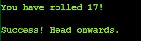

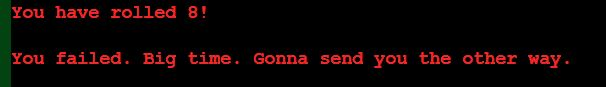

End screens - path endings have ASCII art to differentiate them from path choice screens; 3 possible options as below. The win screen is especially important to give the user a sense of achievement.

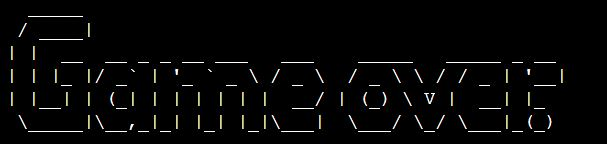

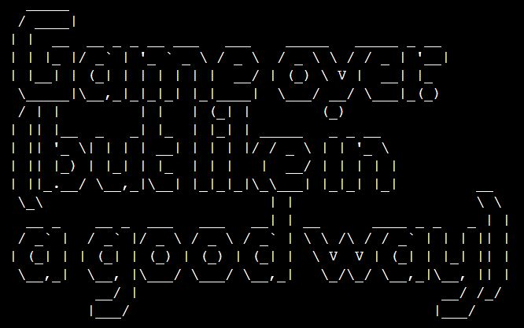

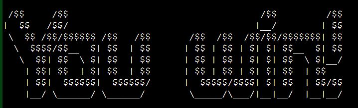

Penny - inventory function for penny 'path' to add an extra aspect to the game; you can only 'find' the penny and add it to your inventory if you successfully go down that exact path (function 'penny'). Conditional statement later in game to check if the user has penny or not. Red and green text will also be utilised here. Inventory reset when the game is reset.

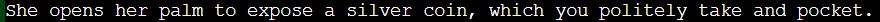

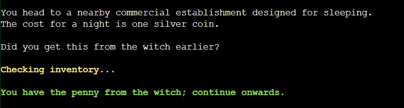

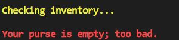

Increased number of lines in the terminal - The number of rows in the terminal has been increased from 24 to 30; this is to allow some of the longer files, such as the intro, to display on the screen at the same time as the choices. Without these additional rows, the user would have to manually scroll up the page to see what they had missed.

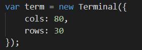

Alternate text - for some paths ('path_or_bridge', 'grab_or_send' and 'barehanded_or_ovenmitts') the text is different depending on which character the user chose at the beginning of the game. This is to enhance the user experience and provide more story variance, especially for users who have played many times.

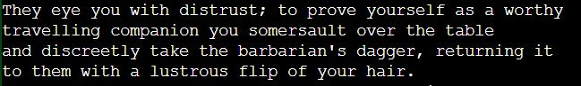

Type 'r' to return to the beginning - require user input to return to the beginning of the game, allowing the user to fully read the current path before triggering a reset and printing the beginning text. Handles user errors such as uppercase 'R' or any other character.

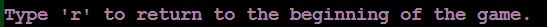

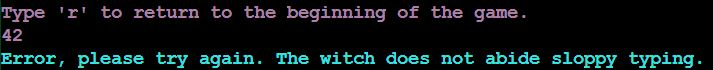

Background - The site background is dark green and the 'Run Program' button is pink, to mimic the colour of rhubarb. It is neutral so as not to detract from the game.

Cyan error messages - I have deliberately made my error messages cyan; the colour is eye-catching enough to draw the user's attention and communicate that action needs to take place, without being alarming. It's not an urgent situation so there's no need to use the harsh red for an accidental user error. Screenshots in individual sections above.

### Technologies

Languages used:

Python 3

HTML5

CSS

Javascript

Frameworks, Libraries and Programs Used:

GitHub - for hosting the site

Heroku - for the deployment of the site

Gitpod - for editing the files

[TAAG](http://www.patorjk.com/software/taag/) - for the ASCII text

[Colorama](https://pypi.org/project/colorama/) - for the coloured text

### Testing 

### Code Validation

[Python validator](http://pep8online.com/) - 14 errors, all code E501 line too long. Each checked and all would break functionality if lines are shortened. All efforts were made to reduce the number of E501s, including altering variable names, dividing print statements and shortening file names.

[Javascript validator](https://jshint.com/) - passes with no errors and 1 warning (code written by the Code Institute)

[HTML validator](https://validator.w3.org/) - passes with no errors or warnings (code written by the Code Institute)

[CSS validator](https://jigsaw.w3.org/css-validator/) - passes with no errors or warnings (code written by the Code Institute except where marked)

### Browser Compatibility

Browser Compatibility checks were run using [BrowserStack](https://www.browserstack.com/) and my computer. The results are:

Firefox - &#9745;

Chrome - &#9745;

Opera - &#9745;

Safari - &#9745;

Microsoft Edge - &#9745;

### Performance Testing

Performance testing was conducted using [Lighthouse](https://developers.google.com/web/tools/lighthouse#devtools). The results are:

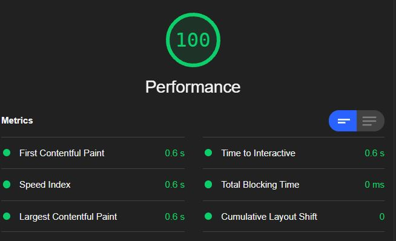

### Manual Testing

I sent the live link to friends and family members for testing and feedback. The site was received positively; design and usability suggestions were considered and acted on. The site was also put up in the Code Institute Slack community for feedback.

Many of the people testing the game reported that they ended up at the 'tea/lasagne' end quite often. While building the game I noticed the same for the 'elf' ending. As these are both towards the beginning of the game I don't want the players to get frustrated at dying/ending too soon, so I stacked the odds for both of these paths in favour of the path that furthers the game. It's not guaranteed to get the other path so the random element is not removed, but rather helped a little to improve the user experience.

I conducted manual testing and recorded the results as follows:

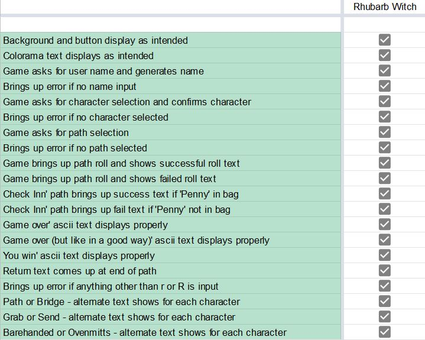

### User Stories Testing

A first time user looking to play the game:

*I want to be able to choose a character*

* Multiple character selection at the beginning of the game, with character descriptions and alternate text on some paths.

*I want the instructions to be clear*

* Instructions at the beginning of the game, marked with a heading. Prompts throughout the game and user feedback provided with writing and colours (character choice printed back in magenta, roll printed clearly with a positive or negative colour).

*I want the game to be engaging*

* Involve the user from the beginning by giving them a fantastical, in-universe name, then provide interactivity with path choice and the random element of the roll. Reward the user with ASCII art at end screens, which differentiates them from the rest of the game. Continue the energy of the game to the error messages so as not to break focus.

A returning user looking to play the game again:

*I want to be able to play the game multiple times without the same ending/path*

* Multiple paths and endings, with the added random element of the roll meaning you will explore paths you may not have intended to. Multiple characters and multiple text options for those characters also provide extended playability.

*I want to be able to choose a different character*

* When the game is reset, the character options and descriptions are presented again.

As the owner of the site:

*I want users to be able to use the game easily and intuitively*

* Clear instructions and user feedback provided.

*I want the game to be engaging*

* Multiple interactive elements: user name generator, character selection and path selection. The random element of the roll provides extra playability as users try to explore paths they were previously unable to. The character selection causes some users to think about each path choice and try to guess which one would give them the best chance of success, providing more playability.

*I want errors to be handled efficiently*

* Error handlers for each possible error, each keeping in theme with the game and communicating to the user what needs to happen next.

*I want what is going on to be clear to the users at all times*

* User feedback is regularly provided, through clear text and the use of coloured text.

### Debugging and known bugs

Inventory - the inventory is a global object so that it can be accessed by all functions without being passed through every function (enough is being passed through, and it only needs to be actively used in 2 functions). When the game is reset the inventory also needs to be reset, so I have added code to the reset_game function that checks for the penny and removes it if it exists.
I tested initialising the function in main() or early game functions but it did not work without passing it through all the functions. The above seemed to be the simplest solution.
Originally I was trying to pass the penny through to the check_inn function as a value, which wouldn't work without being passed to more functions as mentioned, but eventually realised that I was trying to make things too complicated and it is an object just like real life, that needs to be kept in a 'bag', in this case a list, that I can take it in and out of when needed.

In the path functions (path_or_bridge, dangerous_or_tea etc) almost all of the game functionality is tied up in neat functions. The only thing that I could not tie up was the stats, which creates a class instance and uses that to assign the stat for the appropriate character class and path. After much work on my own and discussing this problem with my mentor, it looked like the only way around this was to refactor the whole game, placing all the paths within classes. After experimentation and consideration I decided this would probably be a similar amount of code and complexity to my current approach, and kept what I currently have.

### Deployment

### Publishing

The project was deployed using Heroku. The process is as follows:

Once you have signed up to Heroku, on the top right of the dashboard there is a button labelled 'New'. This will open a dropdown; please select 'Create new app'. On the next page you can choose your region and a name for the project. Then click 'Create app'.

On the next page there is a menu along the top. Navigate to 'Settings', where you will find the config vars. Scroll down to the section named 'Config vars' and click on the button labelled 'Reveal config vars'.

For the current iteration of this program, the singular config var needed is PORT 8000. Please enter the key as 'PORT' and the value as '8000', then hit 'Add'.

Just underneath 'Config vars' you should see 'Buildpacks'. Here you can add Python and Node.js scripts to the environment. Click on 'Add buildpack' and a menu with multiple buildpacks will open.

The order is very important. Please add Python first, by clicking on the Python button and then selecting 'Save changes'. Then go back into the 'Add buildpack' menu and select 'Node.js', and save your changes.

If you scroll back to the top of the page you will find the 'Deploy' tab, which has multiple options for deployment. I used Github for this project. When you click on the Github button a bar will come up for you to search for the repo you wish to connect to.

Once you have connected, you have the option to deploy automatically (the app will update every time you push) or manually (update only when you choose). I chose automatic but you can do what suits you.

After the first push/update, your app will be ready to go!

For the Colorama library, the requirements.txt file needs to have colorama==0.4.4 saved. Before the next push, enter 'pip3 freeze > requirements.txt'. If you add any libraries please make sure to add the requirements to the requirements.txt file and enter this command again, along with any config vars if you need them. Colorama does not need any config vars.

The live link is:
[The Rhubarb Witch](https://the-rhubarb-witch.herokuapp.com/)

### Forking and Cloning
 
To save a copy of the code and work on it yourself, here are the steps for forking and cloning using Github:

In the repository, click the 'Fork' button, which is on the top right-hand side, next to 'Star'.

Github will automatically create a new repo, which is forked from the original. If you would like to clone it you have two options:

Within the repository, click the 'Code' dropdown, which is located next to 'Add File' on the right (underneath the Settings tab); there is an option to download all files and save a copy locally.

In the same 'Code' dropdown, you can opt to open the code with GitHub Desktop and work from there.

### Credits

Research for information on Dungeons and Dragons character class information comes from:
 - [Dungeons and Dragons Fandom Wiki](https://dungeonsdragons.fandom.com/wiki/Dungeons_and_Dragons_Wiki)
 - [D&D Beyond](https://www.dndbeyond.com/)

All HTML, CSS and Javascript (except the minimal amount of CSS where marked) are created by Code Institute for the purpose of creating a functioning terminal environment within a webpage. Many thanks to CI for this!

All story text was written by myself.

ASCII art text for 'Game over' and 'You win' screens generated on [TAAG](http://www.patorjk.com/software/taag/).

Generated user names from [Wizard Name Generator](https://elyserh.github.io/wizard-name-generator/index.html); primarily provided by friends and family. The main difference between the Javascript version and this one is that in the Javascript one the names exist as a global object declared at the beginning of the program. Here I decided to neaten up the program and save the names in a .txt file which the functions reads and processes.

### Acknowledgements

Many thanks to my mentor Maranatha Ilesanmi for his guidance. Thanks also to my wife Finola for her continued support and constant testing.
